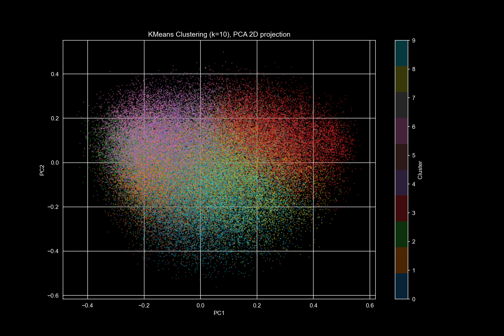
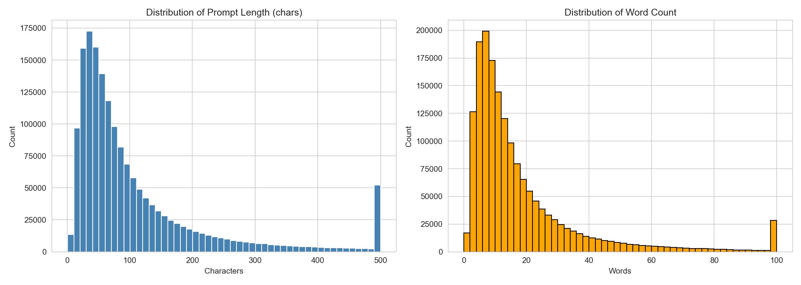
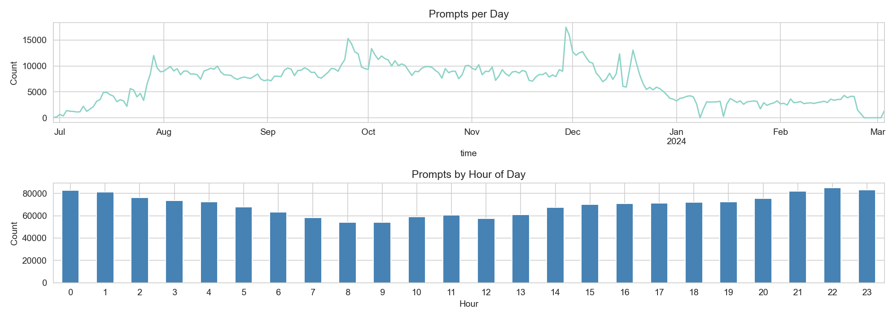
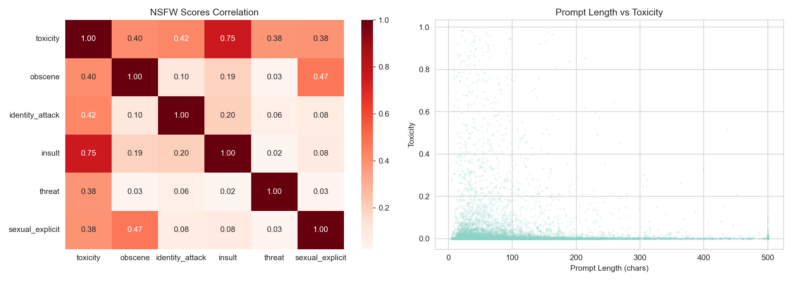

# What Do People Ask Video AI to Generate?

<p align="center">
  
</p>

People are generating millions of videos with AI tools like Sora, Runway, and Pika — but what exactly are they asking for? This project digs into **1.67 million real user prompts** from the [VidProM](https://vidprom.github.io/) dataset to find out.

We go from raw data all the way to a working API: exploratory analysis, unsupervised clustering, and a FastAPI service that can classify any new prompt into a thematic group.

**Dataset:** [VidProM: A Million-scale Real Prompt-Gallery Dataset for Text-to-Video Diffusion Models](https://arxiv.org/abs/2403.06098) (Wang et al., 2024)

---

## Key Findings

- The typical prompt is just **11 words** long — people describe scenes, not write essays
- **98% of prompts are clean.** Only 1.89% exceed a toxicity threshold of 0.5
- Data spans **248 days** (Jun 2023 — Mar 2024), covering the early adoption wave of video AI
- Unsupervised clustering reveals **10 distinct thematic groups** — from nature landscapes to anime to horror

| Cluster | Theme | Count |
|---------|-------|-------|
| 0 | Discord junk (metadata leaking into prompts) | 3,924 |
| 1 | Epic/historical scenes (warriors, mythology) | 9,553 |
| 2 | Animals/creatures (cats, owls, cartoon animals) | 10,132 |
| 3 | Cinematic/aesthetic (8K, realism, aspect ratios) | 12,691 |
| 4 | Mixed/general (diverse, no clear theme) | 15,700 |
| 5 | Women/girls (female characters, portraits) | 8,929 |
| 6 | Men/characters (male characters, celebrities) | 9,636 |
| 7 | Horror/dark (sci-fi, dark atmosphere) | 7,478 |
| 8 | Animation/cartoon (anime, 3D styles) | 10,694 |
| 9 | Nature/landscapes (rain, mountains, forests) | 11,263 |

---

## How It Works

The project consists of 3 notebooks and an API, each building on the previous one:

### 1. Exploratory Data Analysis
Full statistical overview of 1.67M prompts: distributions, temporal patterns, NSFW scores, word frequencies and bigrams. Produces 8+ visualizations with conclusions.

[01_eda.ipynb](notebooks/01_eda.ipynb)

### 2. Clustering
100K prompts encoded into 384-dim vectors with `all-MiniLM-L6-v2`, compressed via PCA (384 -> 50 dims), then grouped with KMeans (k=10 chosen via elbow method). Each cluster manually inspected and labeled.

[02_clustering.ipynb](notebooks/02_clustering.ipynb)

### 3. Data Preparation
Pre-computes all statistics and cluster summaries into JSON files so the API can serve them instantly.

[03_prepare_api_data.ipynb](notebooks/03_prepare_api_data.ipynb)

### 4. FastAPI Service
REST API that serves the analysis results and can classify new prompts in real time.

```
GET  /stats/overview          — dataset statistics
GET  /stats/top-words         — most frequent words (with limit param)
GET  /clusters                — list of 10 thematic clusters
GET  /clusters/{id}           — cluster details with sample prompts
POST /analyze                 — classify any prompt into a cluster
```

---

## Sample Visualizations

| Prompt Length Distribution | Temporal Patterns |
|---|---|
|  |  |

| NSFW Analysis | Cluster Scatter Plot |
|---|---|
|  |  |

---

## Quick Start

```bash
git clone https://github.com/yourusername/vidprom-explorer.git
cd vidprom-explorer
python -m venv .venv && source .venv/bin/activate
pip install -r requirements.txt
```

Download the dataset:
```bash
python scripts/download_data.py
```

Run the notebooks in order (`01_eda` -> `02_clustering` -> `03_prepare_api_data`), then start the API:
```bash
uvicorn app.main:app --reload
```

Open `http://127.0.0.1:8000/docs` for interactive Swagger documentation.

---

## Project Structure

```
vidprom-explorer/
├── notebooks/
│   ├── 01_eda.ipynb                # Exploratory data analysis
│   ├── 02_clustering.ipynb         # Embeddings + KMeans clustering
│   └── 03_prepare_api_data.ipynb   # Pre-compute data for API
├── app/
│   ├── main.py                     # FastAPI application
│   ├── data_loader.py              # Data loading (lifespan)
│   ├── schemas.py                  # Pydantic response models
│   └── routers/
│       ├── stats.py                # /stats/* endpoints
│       ├── clusters.py             # /clusters/* endpoints
│       └── analyze.py              # POST /analyze endpoint
├── scripts/
│   └── download_data.py
├── models/                         # Saved PCA + KMeans models
├── data/                           # Dataset + pre-computed JSONs
└── requirements.txt
```

## Tools & Libraries

- **Data:** pandas, numpy
- **Visualization:** matplotlib, seaborn, wordcloud
- **NLP:** sentence-transformers ([all-MiniLM-L6-v2](https://huggingface.co/sentence-transformers/all-MiniLM-L6-v2))
- **ML:** scikit-learn (PCA, KMeans)
- **API:** FastAPI, Pydantic, uvicorn

## References

- Wang et al. — [VidProM: A Million-scale Real Prompt-Gallery Dataset for Text-to-Video Diffusion Models](https://arxiv.org/abs/2403.06098) (2024)
- Reimers & Gurevych — [Sentence-BERT: Sentence Embeddings using Siamese BERT-Networks](https://arxiv.org/abs/1908.10084) (2019)
